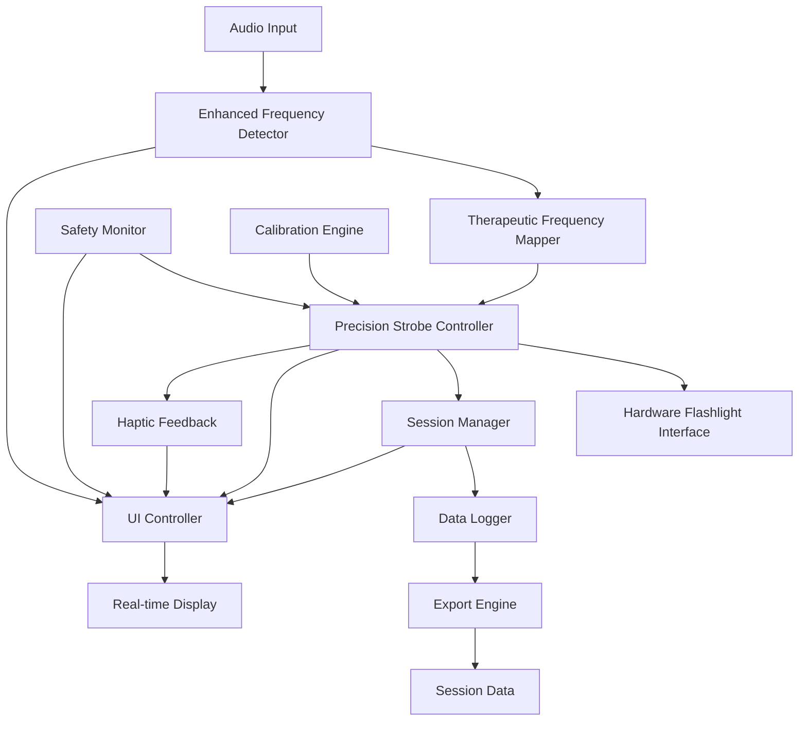

# Design Document

## Overview

This design document outlines the architecture for transforming the SoundToLightTherapy iOS app into a medically accurate stroboscopic light therapy system. The solution addresses the core issue where the current app does not provide true Hz-accurate strobing (e.g., 30 Hz should equal exactly 30 complete on/off cycles per second). The enhanced system will deliver precise frequency-based light therapy through improved timing algorithms, hardware optimization, and comprehensive safety features.

## Architecture

### High-Level Architecture



### Core Components

1. **Enhanced Frequency Detector**: Advanced FFT-based audio analysis with therapeutic frequency mapping
2. **Precision Strobe Controller**: High-accuracy timing engine for flashlight control
3. **Safety Monitor**: Real-time safety checks and photosensitivity protection
4. **Calibration Engine**: Hardware timing validation and correction
5. **User Interface Controller**: Real-time visual feedback and user interaction
6. **Session Manager**: Comprehensive session tracking and data collection
7. **Therapeutic Frequency Mapper**: Intelligent mapping of audio frequencies to therapeutic ranges

## Components and Interfaces

### 1. Enhanced Frequency Detector

**Purpose**: Provide accurate, real-time frequency detection with therapeutic relevance

**Key Improvements**:
- Implement windowed FFT with overlap for smoother frequency tracking with <100ms detection latency
- Add spectral peak tracking for consistent frequency identification with <200ms update response
- Include noise floor detection to filter out ambient noise with user-configurable thresholds
- Support multiple frequency extraction methods (dominant, harmonic, rhythmic) with automatic mode selection
- Frequency smoothing options for inconsistent audio input
- Therapeutic frequency prioritization for 1-40Hz optimal range

**Interface**:
```swift
public actor EnhancedFrequencyDetector {
    func detectTherapeuticFrequency(from audioData: [Float]) async throws -> TherapeuticFrequencyResult
    func calibrateNoiseFloor() async throws
    func setDetectionMode(_ mode: FrequencyDetectionMode) async
    func enableFrequencySmoothing(_ enabled: Bool) async
    func setNoiseThreshold(_ threshold: Float) async
    func getDetectionLatency() async -> TimeInterval
}

public struct TherapeuticFrequencyResult {
    let targetFrequency: Float          // Mapped therapeutic frequency (0.5-100 Hz)
    let sourceFrequency: Float          // Original detected frequency
    let confidence: Float               // Detection confidence (0.0-1.0)
    let therapeuticCategory: TherapyType // Alpha, Beta, Gamma, etc.
    let recommendedDuration: TimeInterval // Suggested therapy duration
}

public enum FrequencyDetectionMode {
    case dominant        // Use strongest frequency component
    case rhythmic       // Extract rhythmic/tempo information
    case harmonic       // Focus on harmonic content
    case adaptive       // Automatically choose best method
}
```

### 2. Precision Strobe Controller

**Purpose**: Deliver microsecond-accurate flashlight strobing at therapeutic frequencies

**Key Features**:
- High-resolution timing using CADisplayLink and DispatchSourceTimer with <5ms jitter for frequencies up to 40Hz
- Hardware capability detection and adaptive frequency limiting with real-time capability reporting
- Jitter compensation and timing drift correction with automatic recalibration
- Emergency stop with <50ms response time
- Haptic feedback fallback for hardware-limited frequencies
- Battery level monitoring with accuracy impact warnings

**Interface**:
```swift
public actor PrecisionStrobeController {
    func startStrobing(frequency: Float, intensity: Float) async throws
    func updateFrequency(_ frequency: Float) async throws
    func stopStrobing() async throws
    func emergencyStop() async throws
    func getActualFrequency() async -> Float
    func getTimingAccuracy() async -> StrobeAccuracyMetrics
    func enableHapticFallback(_ enabled: Bool) async
    func getBatteryImpactWarning() async -> Bool
    func getHardwareCapabilities() async -> HardwareCapabilities
}

public struct HardwareCapabilities {
    let maxAccurateFrequency: Float          // Maximum frequency with <5ms jitter
    let maxAttemptableFrequency: Float       // Hardware absolute maximum
    let supportsHapticFeedback: Bool         // Haptic fallback availability
    let batteryOptimizationAvailable: Bool   // Adaptive intensity support
}

public struct StrobeAccuracyMetrics {
    let targetFrequency: Float
    let achievedFrequency: Float
    let averageJitter: TimeInterval      // Average timing deviation
    let maxJitter: TimeInterval          // Maximum timing deviation
    let accuracyPercentage: Float        // Overall accuracy (0.0-100.0)
    let droppedCycles: Int              // Number of missed strobe cycles
}
```

### 3. Safety Monitor

**Purpose**: Ensure safe operation and prevent photosensitive reactions

**Key Features**:
- Real-time frequency monitoring for epilepsy-triggering ranges (15-25 Hz)
- Session duration limits with selectable breaks
- User acknowledgment system for safety warnings and medical disclaimers
- Emergency stop functionality with <50ms response time
- Safety mode with 20Hz frequency limitation
- App launch safety warnings with required user acknowledgment

**Interface**:
```swift
public actor SafetyMonitor {
    func validateFrequency(_ frequency: Float) async throws -> SafetyValidation
    func checkSessionDuration(_ duration: TimeInterval) async throws
    func requireSafetyAcknowledgment() async throws -> Bool
    func enableSafetyMode(_ enabled: Bool) async
}

public struct SafetyValidation {
    let isFrequencySafe: Bool
    let warnings: [SafetyWarning]
    let recommendedAction: SafetyAction
}

public enum SafetyWarning {
    case epilepsyRisk(frequency: Float)
    case extendedSession(duration: TimeInterval)
    case highIntensity(level: Float)
    case batteryLow
}

public enum SafetyAction {
    case allowWithWarning
    case requireConfirmation
    case forceStop
    case suggestBreak
}
```

### 7. Calibration Engine

**Purpose**: Validate and correct timing accuracy for therapeutic precision

**Key Features**:
- Hardware timing measurement using high-resolution counters
- Automatic calibration factor calculation
- Performance benchmarking across different frequencies
- Calibration data persistence

**Interface**:
```swift
public actor CalibrationEngine {
    func performFullCalibration() async throws -> CalibrationResults
    func validateFrequency(_ frequency: Float) async throws -> FrequencyValidation
    func getCalibrationFactors() async -> CalibrationFactors
    func resetCalibration() async throws
}

public struct CalibrationResults {
    let maxAccurateFrequency: Float      // Highest frequency with >95% accuracy
    let timingCorrections: [Float: TimeInterval] // Frequency-specific corrections
    let hardwareCapabilities: HardwareSpecs
    let recommendedFrequencyRanges: [ClosedRange<Float>]
}
```

### 5. User Interface Controller

**Purpose**: Provide real-time visual feedback and user interaction for therapy monitoring

**Key Features**:
- Real-time frequency detection display with visual indicators
- Target vs. achieved frequency comparison with accuracy percentage
- Smooth visual transitions for frequency changes with haptic feedback
- Accuracy warning indicators when precision falls below 95%
- Session statistics display with therapeutic effectiveness metrics

**Interface**:
```swift
public actor UIController {
    func updateFrequencyDisplay(target: Float, achieved: Float, accuracy: Float) async
    func showAccuracyWarning(_ show: Bool) async
    func displaySessionStatistics(_ stats: SessionSummary) async
    func triggerHapticFeedback(for event: HapticEvent) async
    func updateVisualTransition(from oldFreq: Float, to newFreq: Float) async
}

public enum HapticEvent {
    case frequencyChange
    case accuracyWarning
    case safetyAlert
    case sessionComplete
}
```

### 6. Session Manager

**Purpose**: Comprehensive session tracking, data collection, and export

**Key Features**:
- Real-time session metrics collection with microsecond precision logging
- Frequency accuracy tracking with target vs. achieved frequency comparison
- Session history management with trend analysis
- Data export in CSV and JSON formats with frequency histograms
- Automatic timing drift detection and recalibration logging

**Interface**:
```swift
public actor SessionManager {
    func startSession(configuration: SessionConfiguration) async throws
    func updateSessionMetrics(_ metrics: SessionMetrics) async
    func endSession() async throws -> SessionSummary
    func exportSessionData(format: ExportFormat) async throws -> Data
    func getSessionHistory() async -> [SessionSummary]
}

public struct SessionConfiguration {
    let targetFrequencyRange: ClosedRange<Float>
    let maxDuration: TimeInterval
    let safetyMode: Bool
    let calibrationRequired: Bool
}

public enum ExportFormat {
    case csv
    case json
    case detailedReport  // Includes frequency histograms and timing analysis
}

public struct SessionSummary {
    let sessionId: UUID
    let startTime: Date
    let duration: TimeInterval
    let frequencyStats: FrequencyStatistics
    let accuracyMetrics: StrobeAccuracyMetrics
    let safetyEvents: [SafetyEvent]
    let frequencyHistogram: [Float: Int]     // Frequency distribution data
    let timingDeviations: [TimeInterval]     // Detailed timing accuracy data
    let averageAccuracyPercentage: Float     // Overall session accuracy
}

public struct SafetyEvent {
    let timestamp: Date
    let eventType: SafetyWarning
    let userResponse: SafetyAction
    let frequencyAtEvent: Float
}
```

## Data Models

### Core Data Structures

```swift
// Therapeutic frequency categories based on brainwave research
public enum TherapyType: CaseIterable {
    case delta      // 0.5-4 Hz - Deep sleep, healing
    case theta      // 4-8 Hz - Meditation, creativity
    case alpha      // 8-13 Hz - Relaxation, focus
    case beta       // 13-30 Hz - Active thinking, alertness
    case gamma      // 30-100 Hz - Cognitive enhancement, awareness
    
    var frequencyRange: ClosedRange<Float> {
        switch self {
        case .delta: return 0.5...4.0
        case .theta: return 4.0...8.0
        case .alpha: return 8.0...13.0
        case .beta: return 13.0...30.0
        case .gamma: return 30.0...100.0
        }
    }
    
    var isOptimalTherapeuticRange: Bool {
        // Prioritize 1-40 Hz range for optimal therapeutic effect
        return self != .gamma || frequencyRange.lowerBound <= 40.0
    }
}

// Frequency mapping strategies for different input types
public enum FrequencyMappingStrategy {
    case direct              // Direct 1:1 mapping within therapeutic range
    case proportional        // Proportional scaling to therapeutic range
    case harmonic           // Use harmonic relationships for musical input
    case rhythmic           // Extract rhythmic patterns from complex audio
    
    func mapToTherapeutic(_ inputFreq: Float) -> Float {
        switch self {
        case .direct:
            return max(0.5, min(100.0, inputFreq))
        case .proportional:
            // Map any input range proportionally to 0.5-100 Hz
            return 0.5 + (inputFreq.truncatingRemainder(dividingBy: 99.5))
        case .harmonic:
            // Use musical harmonic relationships
            return findTherapeuticHarmonic(of: inputFreq)
        case .rhythmic:
            // Extract tempo/rhythm and map to therapeutic frequency
            return extractRhythmicFrequency(from: inputFreq)
        }
    }
    
    private func findTherapeuticHarmonic(of frequency: Float) -> Float {
        // Implementation would find the most therapeutically relevant harmonic
        // This is a placeholder for the actual harmonic analysis logic
        return frequency
    }
    
    private func extractRhythmicFrequency(from frequency: Float) -> Float {
        // Implementation would extract rhythmic patterns from complex audio
        // This is a placeholder for the actual rhythmic analysis logic
        return frequency
    }
}

// Real-time session metrics
public struct SessionMetrics {
    let timestamp: Date
    let targetFrequency: Float
    let achievedFrequency: Float
    let strobeAccuracy: Float
    let audioLevel: Float
    let batteryLevel: Float
}

// Frequency analysis results
public struct FrequencyStatistics {
    let averageFrequency: Float
    let frequencyRange: ClosedRange<Float>
    let dominantTherapyType: TherapyType
    let frequencyStability: Float        // Measure of frequency consistency
    let therapeuticEffectiveness: Float  // Calculated therapeutic value
}
```

## Error Handling

### Comprehensive Error Management

```swift
public enum StroboscopicTherapyError: Error {
    case hardwareUnavailable
    case frequencyOutOfRange(Float)
    case timingAccuracyInsufficient(achieved: Float, required: Float)
    case safetyViolation(SafetyWarning)
    case calibrationRequired
    case sessionDurationExceeded
    case batteryTooLow
    case audioInputFailed
    case emergencyStopActivated
}

// Error recovery strategies
public protocol ErrorRecoveryStrategy {
    func canRecover(from error: StroboscopicTherapyError) -> Bool
    func recover(from error: StroboscopicTherapyError) async throws
}
```

## Testing Strategy

### 1. Unit Testing

**Frequency Detection Testing**:
- Test FFT accuracy with known sine wave inputs
- Validate frequency mapping algorithms
- Test noise floor detection and filtering
- Verify therapeutic frequency categorization

**Strobe Timing Testing**:
- Measure actual strobe timing against expected values
- Test timing accuracy across different frequencies
- Validate jitter compensation algorithms
- Test emergency stop response times

### 2. Integration Testing

**End-to-End Therapy Sessions**:
- Test complete audio-to-strobe pipeline
- Validate session data collection and export
- Test safety monitoring during active sessions
- Verify calibration integration with strobe control

### 3. Hardware Performance Testing

**Device-Specific Testing**:
- Test maximum achievable frequencies on different iPhone models
- Measure battery impact of high-frequency strobing
- Test thermal performance during extended sessions
- Validate flashlight hardware limitations

### 4. Safety Testing

**Photosensitivity Protection**:
- Test epilepsy-risk frequency detection and warnings
- Validate emergency stop functionality
- Test session duration limits and break prompts
- Verify safety mode frequency limitations

### 5. Accuracy Validation

**Therapeutic Precision Testing**:
- Use external light sensors to measure actual strobe timing
- Compare achieved frequencies with target frequencies
- Test frequency stability over extended periods
- Validate calibration accuracy improvements

## Implementation Phases

### Phase 1: Core Timing Engine (High Priority)
- Implement PrecisionStrobeController with microsecond timing
- Add hardware capability detection
- Implement emergency stop functionality
- Basic accuracy measurement and reporting

### Phase 2: Enhanced Frequency Detection (High Priority)
- Upgrade FrequencyDetector with advanced FFT analysis
- Add therapeutic frequency mapping
- Implement noise floor detection
- Add multiple detection modes (dominant, rhythmic, harmonic)

### Phase 3: Safety and Calibration (Medium Priority)
- Implement SafetyMonitor with photosensitivity protection
- Add CalibrationEngine for timing validation
- Implement safety warnings and user acknowledgment
- Add session duration monitoring

### Phase 4: Data Collection and Export (Medium Priority)
- Enhance SessionManager with comprehensive metrics
- Add real-time session data logging
- Implement data export functionality
- Add session history and trend analysis

### Phase 5: UI Enhancement and User Experience (Low Priority)
- Update UI with real-time accuracy displays
- Add calibration and validation interfaces
- Implement session statistics visualization
- Add therapeutic frequency recommendations

## Performance Considerations

### Timing Requirements and Optimization
- **Frequency Detection Latency**: <100ms for initial detection, <200ms for frequency changes
- **Strobe Timing Accuracy**: <5ms jitter for frequencies up to 40Hz, best-effort for higher frequencies
- **Emergency Stop Response**: <50ms complete shutdown time
- **UI Update Responsiveness**: Real-time display updates synchronized with detection cycles

### Technical Implementation
- Use CADisplayLink for 60Hz refresh rate synchronization
- Implement DispatchSourceTimer for sub-millisecond precision
- Minimize memory allocations in real-time processing loops
- Use actor isolation to prevent timing interference
- Implement microsecond-precision logging for timing validation

### Battery Optimization
- Implement adaptive intensity based on battery level
- Add low-power mode for extended sessions
- Monitor thermal state and adjust performance accordingly
- Provide battery usage estimates for different frequencies

### Memory Management
- Use circular buffers for audio data processing
- Implement efficient FFT with pre-allocated buffers
- Minimize object creation in real-time loops
- Use value types for performance-critical data structures

## Security and Privacy

### Data Protection
- Store session data locally with encryption
- Implement secure data export with user consent
- Avoid cloud storage of sensitive health data
- Provide data deletion options for privacy compliance

### Medical Compliance
- Include appropriate medical disclaimers
- Implement safety warnings for photosensitive users
- Provide clear usage guidelines and limitations
- Support healthcare provider data sharing (with consent)

This design provides a comprehensive foundation for creating a medically accurate stroboscopic light therapy application that addresses all the identified requirements while maintaining safety, precision, and usability.